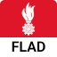
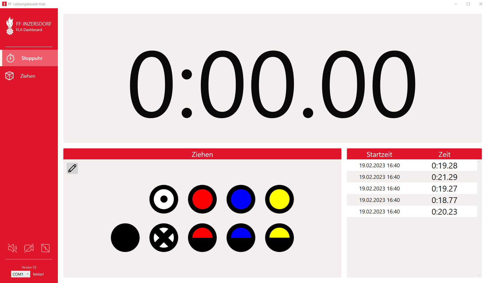

# FLA-Dashboard

  
**Feuerwehr Leistungsabzeichen Dashboard**  
**FF-INZERSDORF**

Windows Applikation zur Unterstützung des Trainings für das Feuerwehrleistungsabzeichen (FLA) in Bronze und Silber. 
Um das FLAD optimal zu nutzen benötigt man neben der **FLAD-Applikation** noch den **FLAD-USB-Controller**.

## Funktionen
- Stoppuhr
- Audiowiedergabe des Angriffsbefehl
- Singlemodus (Start und Stop Funktion über ein Signal)
- Automatisches Aufzeichnen von Videos (benötigt OBS)
- Auslosen der Taktischen Zeichen
- Externe Steuerung über USB-Controller
- Speichern der Zeiten (Local XML)
- Debug Modus (Taste F5)

## USB-Controller

Der Controller wird benötigt um die Externen **Start** und **Stop** Signale an die FLAD-Applikation zu übergeben.  

### Anschlüsse:

- Anschlussklemme (für die Start und Stop Taster)
- 12V DC (Stromversorgung)
- Micro-USB (für die verbindung mit dem Windows Gerät)

<BILD>
  
  

